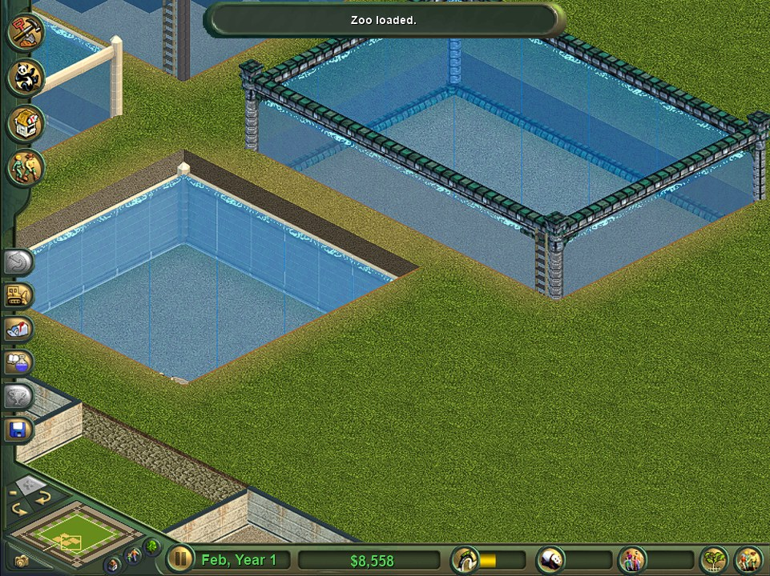
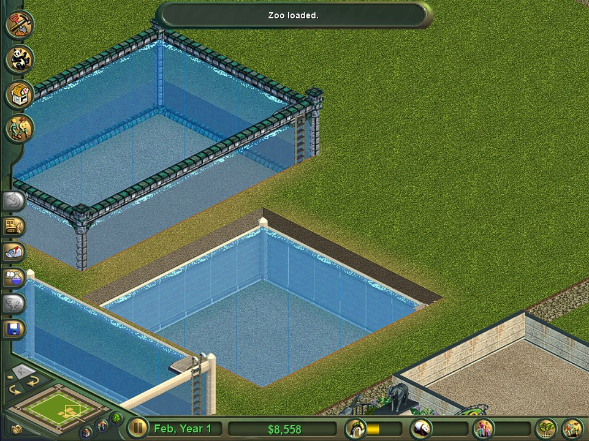
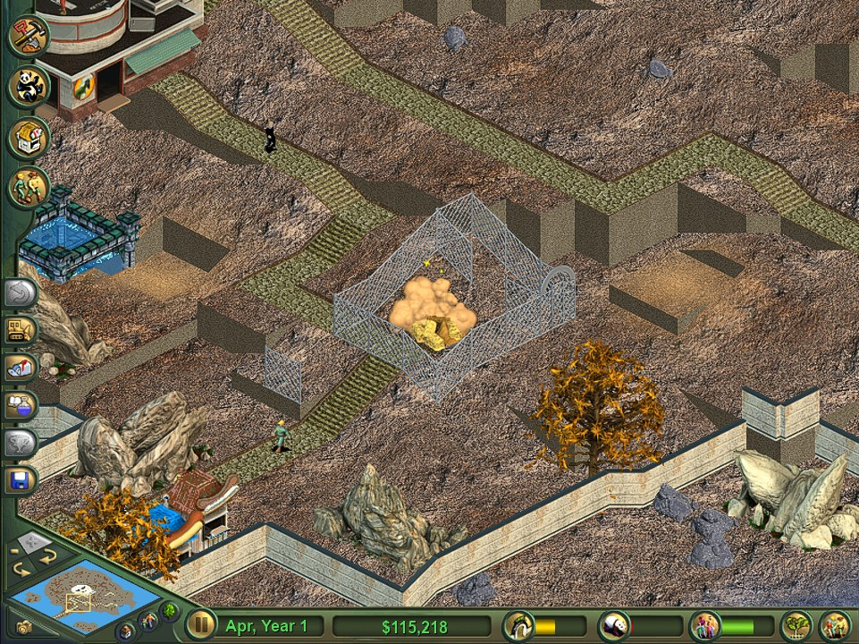
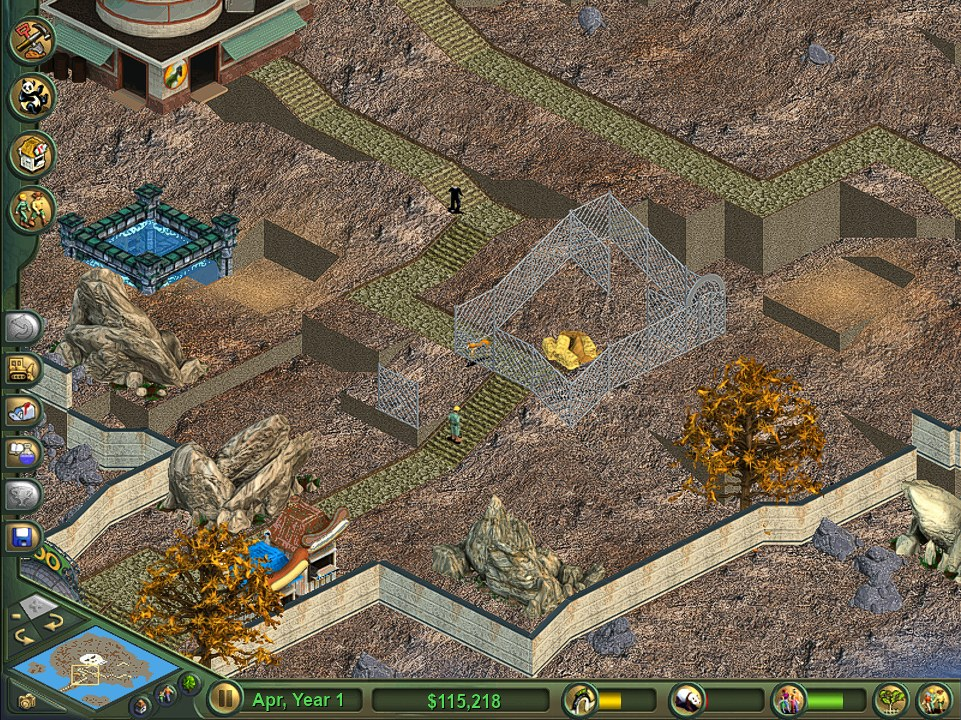
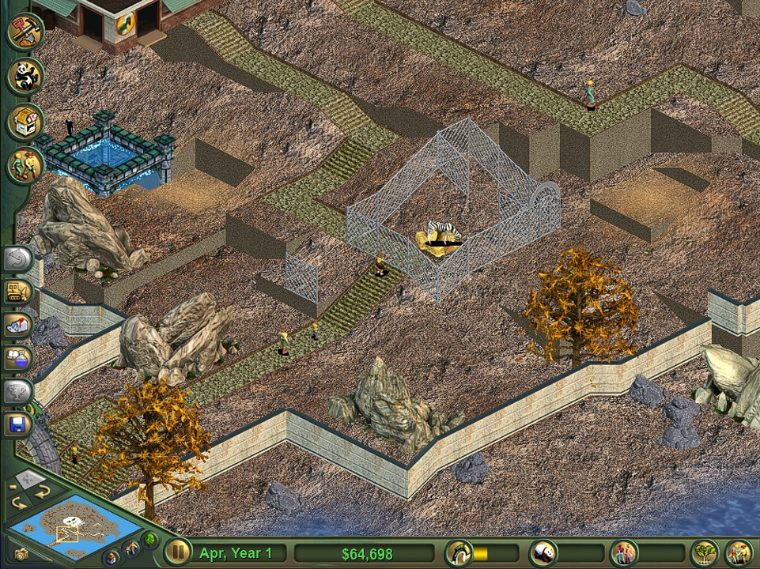
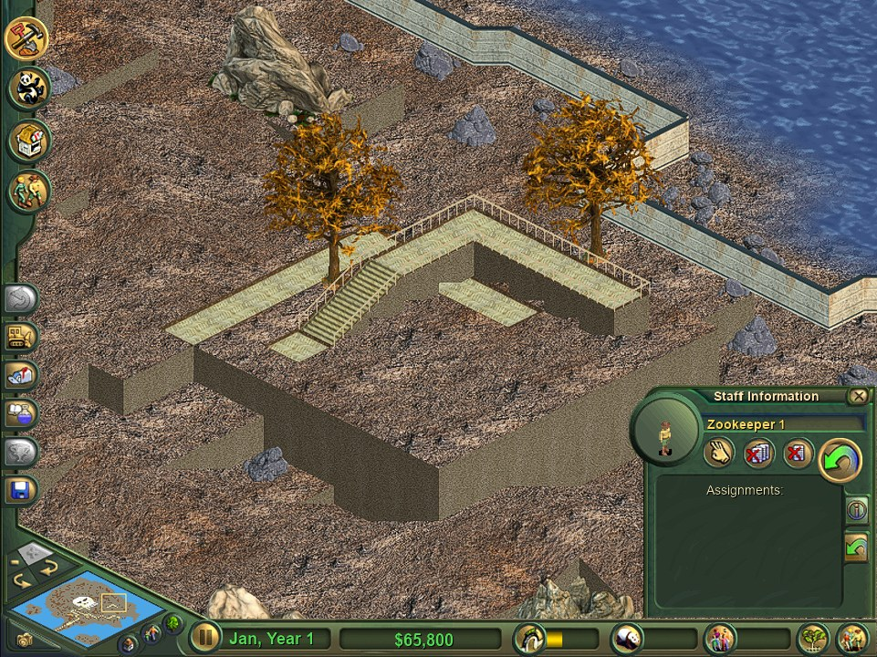
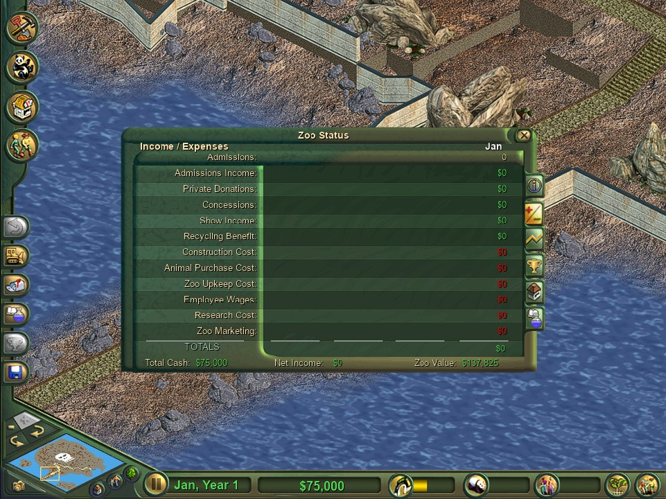
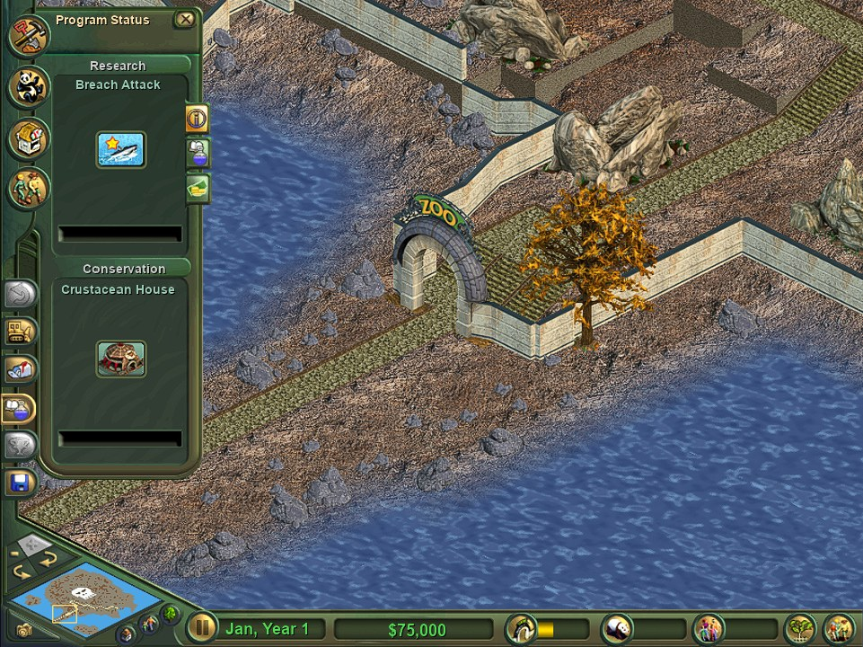

# ZT1-Engine

An open source engine for **Zoo Tycoon 1 (Complete Collection)**, in the spirit of OpenRCT2: the original game is the spec. Behaviour is checked side by side against the original running, and the exact rules (animal happiness, guest needs, zoo rating, research, escapes, predators and more) are recovered from `zoo.exe` rather than guessed. You need your own copy of Zoo Tycoon; the engine reads its files and ships none of its art or sound.

> **Status:** a playable base-game **freeform** zoo, being polished against the original before moving on to Marine Mania and Dinosaur Digs. Expect rough edges, and please report anything that differs from the original.

## Screenshots

| | |
|---|---|
|  |  |
| Tanks: four wall types, raised, with water, ripples and divers' platforms | The view turned: every tank, wall and ladder sorts correctly |
|  |  |
| Predators hunt the prey they list (the original's fight cloud) | Escapes: jumpers jump, climbers climb, bashers break the fence |
|  |  |
| Guests, keepers and the zoo at work | Raised walkways with stairs (an optional addition) |
|  |  |
| The original's panels: Zoo Status, finances, graphs, awards | Research and conservation programs |

## What's usable now

The base game's freeform mode is the focus, and most of it works as in the original:

- **Menus and screens:** loading screen, main menu, freeform and scenario selection with the original descriptions, credits, the in-game HUD and its panels, tooltips, the message list.
- **Saving and loading:** Save Game / Load Game (the original's "Save a zoo..." dialogs) and Continue Saved Game. Saves keep the whole zoo, the view and the way it's turned. (Our own format: the original's `.zoo` saves aren't read yet.)
- **Building:** terraforming (raise, lower, smooth, paint), paths, every fence type and its gates, exhibits and their names, scenery, foliage, rocks, buildings and shops (paintable), shelters and toys, all rotatable; the bulldozer and undo.
- **Animals:** adopting and selling, the original's behaviour sets and animations, eating, drinking, sleeping, shelters and toys, swimming, exhibit suitability and happiness worked out as `zoo.exe` does, breeding, illness, old age.
- **Escapes and predators:** animals get out over or through fences they can jump, climb or break, and through broken or missing pieces. Loose meat-eaters go after guests, guests flee, and keepers dart and crate them. In exhibits, predators hunt the animals they list as prey.
- **Guests:** arriving by the zoo's rating, their needs (hunger, thirst, bathrooms, energy), shops and buildings, tours, donations, thoughts, litter, fleeing escaped animals.
- **Staff:** zookeepers (feeding, cleaning, healing, darting), maintenance workers (litter, trash cans, fence repair), tour guides; hiring, firing and duties.
- **The zoo's business:** the zoo rating as the original works it out, admissions, marketing, finances, graphs, research and conservation programs, freeform goals and awards.
- **Marine Mania tanks** (in progress): every tank wall type, raising and lowering the walls, filling and draining, salt and fresh water, filters, the water's ripples and waves.
- **Sound:** music, ambience, the crowd, guests, animals and buildings.

### Additions beyond the original

Every change from the original is a switch; switched off, the game does what the original does. They're listed and flipped in the in-game dev console (`features`, `set <name> on|off`):

| Switch | What it does |
|---|---|
| `allUnlocked` | every item available in freeform from day one |
| `fenceModes` / `pathModes` | fence and path drags that bend once; Tab cycles the shape |
| `elevatedPaths` | raised walkways and stairs, built from the original's path art |
| `staffPaths` / `smoothRoutes` | staff keep to paths; walkers take straighter routes |
| `mapTooltips` | hints over the map, not only on buttons |
| `hotkeys` | Esc / right-click put tools away, Ctrl+Z undoes, Q/E rotate |

Also: a resizable window at any size with the UI scaled cleanly, and optional GPU FSR upscaling when zoomed in.

## Roadmap

1. **Base Zoo Tycoon freeform, one to one with the original.** Nearly there: now polishing the details players notice.
2. **Marine Mania:** tanks (in progress), marine animals, show tanks and shows, marine specialists.
3. **Dinosaur Digs:** dinosaurs, the Dinosaur Recovery Team, rampages and fence testing.
4. **Scenarios:** every scenario's goals and events.
5. **The original's `.zoo` saves:** loading them.
6. **An options menu** for the additions; then **Linux and macOS**.

## Platforms

Currently supported:
- **Windows** (x64) - Primary development platform

Future planned support:
- Linux
- macOS

## Building

### Prerequisites

- **Windows 10/11** (64-bit)
- **Python 3.8+** (for build scripts)
- **Visual Studio 2022** (or newer) with C++ Desktop Development workload
- **CMake 3.16+**
- **Zoo Tycoon 1** game files (the original game is required; the Complete Collection for Marine Mania and Dinosaur Digs content)

### Quick Build (Windows)

1. Clone the repository:
```bash
git clone --recurse-submodules --remote-submodules https://github.com/AlexC1991/zt1-engine.git
cd zt1-engine
```

2. Run the build script:
```bash
BUILD_ENGINE.bat
```

The build script will:
- Apply source code patches automatically
- Configure and build with CMake/MSBuild
- Copy Zoo Tycoon assets from your installation
- Set up the runtime environment

3. The compiled engine will be in `build/Release/`

### Manual Build

If you prefer to build manually:

```bash
mkdir build
cd build
cmake .. -G "Visual Studio 17 2022" -A x64
cmake --build . --config Release
```

Then copy your Zoo Tycoon game files into the `build/Release` directory.

### Running

Launch the engine:
```bash
cd build/Release
zt1-engine.exe
```

Saved zoos go to `Documents\zt1-engine\Saved Games`, snapshots to `Documents\zt1-engine\screenshots`.

### Testing

`zt1-engine.exe --panel-shots <folder>` runs the test suite: it plays a freeform zoo by itself, checks over 230 behaviours against what the original does, and saves a screenshot of each step, with the results in `<folder>/timings.txt`. Switches for reproducing problems:

- `ZT_FLAT_LAB=1` makes the zoo one level of plain grass to test on
- `ZT_TANK_LAB=<wall type>,<wall type>` builds two tanks and shoots them at four heights from all four sides
- `ZT_VIEW_SAVE=<file.zt1save>` loads a saved zoo and shoots it from all four sides

## Project Structure

```
zt1-engine/
├── src/                    # C++ source code
│   └── ui/                 # The original's UI layouts and widgets
├── docs/                   # File formats, findings, screenshots
├── platform/               # Platform-specific code
├── vendor/                 # Third-party libraries
├── engine-build-resources/ # Build system and patches
├── fonts/                  # Font files
└── BUILD_ENGINE.bat        # Windows build launcher
```

## Contributing

Contributions and bug reports are welcome. The most useful report is a difference from the original game: what you did, what the original does and what the engine does, with screenshots or a saved zoo.

## License

ZT1-Engine is available under the MIT license:

```
Copyright (c) 2025 Wouter (sharkwouter) Wijsman

Permission is hereby granted, free of charge, to any person obtaining a copy
of this software and associated documentation files (the "Software"), to deal
in the Software without restriction, including without limitation the rights
to use, copy, modify, merge, publish, distribute, sublicense, and/or sell
copies of the Software, and to permit persons to whom the Software is
furnished to do so, subject to the following conditions:

The above copyright notice and this permission notice shall be included in all
copies or substantial portions of the Software.

THE SOFTWARE IS PROVIDED "AS IS", WITHOUT WARRANTY OF ANY KIND, EXPRESS OR
IMPLIED, INCLUDING BUT NOT LIMITED TO THE WARRANTIES OF MERCHANTABILITY,
FITNESS FOR A PARTICULAR PURPOSE AND NONINFRINGEMENT. IN NO EVENT SHALL THE
AUTHORS OR COPYRIGHT HOLDERS BE LIABLE FOR ANY CLAIM, DAMAGES OR OTHER
LIABILITY, WHETHER IN AN ACTION OF CONTRACT, TORT OR OTHERWISE, ARISING FROM,
OUT OF OR IN CONNECTION WITH THE SOFTWARE OR THE USE OR OTHER DEALINGS IN THE
SOFTWARE.
```

## Third Party Licenses

ZT1-Engine uses external libraries:
- SDL2
- SDL2_image
- SDL2_mixer
- SDL2_ttf
- FreeType2
- pe-resource-loader
- libzip
- libz

The icon was made using [a picture from Magda Ehlers from Pexels](https://www.pexels.com/photo/zebra-s-eye-760958/).

### FreeType License

```
                    The FreeType Project LICENSE
                    ----------------------------

                            2006-Jan-27

                    Copyright 1996-2002, 2006 by
          David Turner, Robert Wilhelm, and Werner Lemberg


Introduction
============

  The FreeType  Project is distributed in  several archive packages;
  some of them may contain, in addition to the FreeType font engine,
  various tools and  contributions which rely on, or  relate to, the
  FreeType Project.

  This  license applies  to all  files found  in such  packages, and
  which do not  fall under their own explicit  license.  The license
  affects  thus  the  FreeType   font  engine,  the  test  programs,
  documentation and makefiles, at the very least.

  This  license   was  inspired  by  the  BSD,   Artistic,  and  IJG
  (Independent JPEG  Group) licenses, which  all encourage inclusion
  and  use of  free  software in  commercial  and freeware  products
  alike.  As a consequence, its main points are that:

    o We don't promise that this software works. However, we will be
      interested in any kind of bug reports. (`as is' distribution)

    o You can  use this software for whatever you  want, in parts or
      full form, without having to pay us. (`royalty-free' usage)

    o You may not pretend that  you wrote this software.  If you use
      it, or  only parts of it,  in a program,  you must acknowledge
      somewhere  in  your  documentation  that  you  have  used  the
      FreeType code. (`credits')

  We  specifically  permit  and  encourage  the  inclusion  of  this
  software, with  or without modifications,  in commercial products.
  We  disclaim  all warranties  covering  The  FreeType Project  and
  assume no liability related to The FreeType Project.


  Finally,  many  people  asked  us  for  a  preferred  form  for  a
  credit/disclaimer to use in compliance with this license.  We thus
  encourage you to use the following text:

   """
    Portions of this software are copyright © <year> The FreeType
    Project (www.freetype.org).  All rights reserved.
   """

  Please replace <year> with the value from the FreeType version you
  actually use.


Legal Terms
===========

0. Definitions
--------------

  Throughout this license,  the terms `package', `FreeType Project',
  and  `FreeType  archive' refer  to  the  set  of files  originally
  distributed  by the  authors  (David Turner,  Robert Wilhelm,  and
  Werner Lemberg) as the `FreeType Project', be they named as alpha,
  beta or final release.

  `You' refers to  the licensee, or person using  the project, where
  `using' is a generic term including compiling the project's source
  code as  well as linking it  to form a  `program' or `executable'.
  This  program is  referred to  as  `a program  using the  FreeType
  engine'.

  This  license applies  to all  files distributed  in  the original
  FreeType  Project,   including  all  source   code,  binaries  and
  documentation,  unless  otherwise  stated   in  the  file  in  its
  original, unmodified form as  distributed in the original archive.
  If you are  unsure whether or not a particular  file is covered by
  this license, you must contact us to verify this.

  The FreeType  Project is copyright (C) 1996-2000  by David Turner,
  Robert Wilhelm, and Werner Lemberg.  All rights reserved except as
  specified below.

1. No Warranty
--------------

  THE FREETYPE PROJECT  IS PROVIDED `AS IS' WITHOUT  WARRANTY OF ANY
  KIND, EITHER  EXPRESS OR IMPLIED,  INCLUDING, BUT NOT  LIMITED TO,
  WARRANTIES  OF  MERCHANTABILITY   AND  FITNESS  FOR  A  PARTICULAR
  PURPOSE.  IN NO EVENT WILL ANY OF THE AUTHORS OR COPYRIGHT HOLDERS
  BE LIABLE  FOR ANY DAMAGES CAUSED  BY THE USE OR  THE INABILITY TO
  USE, OF THE FREETYPE PROJECT.

2. Redistribution
-----------------

  This  license  grants  a  worldwide, royalty-free,  perpetual  and
  irrevocable right  and license to use,  execute, perform, compile,
  display,  copy,   create  derivative  works   of,  distribute  and
  sublicense the  FreeType Project (in  both source and  object code
  forms)  and  derivative works  thereof  for  any  purpose; and  to
  authorize others  to exercise  some or all  of the  rights granted
  herein, subject to the following conditions:

    o Redistribution of  source code  must retain this  license file
      (`FTL.TXT') unaltered; any  additions, deletions or changes to
      the original  files must be clearly  indicated in accompanying
      documentation.   The  copyright   notices  of  the  unaltered,
      original  files must  be  preserved in  all  copies of  source
      files.

    o Redistribution in binary form must provide a  disclaimer  that
      states  that  the software is based in part of the work of the
      FreeType Team,  in  the  distribution  documentation.  We also
      encourage you to put an URL to the FreeType web page  in  your
      documentation, though this isn't mandatory.

  These conditions  apply to any  software derived from or  based on
  the FreeType Project,  not just the unmodified files.   If you use
  our work, you  must acknowledge us.  However, no  fee need be paid
  to us.

3. Advertising
--------------

  Neither the  FreeType authors and  contributors nor you  shall use
  the name of the  other for commercial, advertising, or promotional
  purposes without specific prior written permission.

  We suggest,  but do not require, that  you use one or  more of the
  following phrases to refer  to this software in your documentation
  or advertising  materials: `FreeType Project',  `FreeType Engine',
  `FreeType library', or `FreeType Distribution'.

  As  you have  not signed  this license,  you are  not  required to
  accept  it.   However,  as  the FreeType  Project  is  copyrighted
  material, only  this license, or  another one contracted  with the
  authors, grants you  the right to use, distribute,  and modify it.
  Therefore,  by  using,  distributing,  or modifying  the  FreeType
  Project, you indicate that you understand and accept all the terms
  of this license.

4. Contacts
-----------

  There are two mailing lists related to FreeType:

    o freetype@nongnu.org

      Discusses general use and applications of FreeType, as well as
      future and  wanted additions to the  library and distribution.
      If  you are looking  for support,  start in  this list  if you
      haven't found anything to help you in the documentation.

    o freetype-devel@nongnu.org

      Discusses bugs,  as well  as engine internals,  design issues,
      specific licenses, porting, etc.

  Our home page can be found at

    https://www.freetype.org
```

The licenses for the other libraries can be found on their respective websites and in the source tree of zt1-engine at: https://github.com/openztcc/zt1-engine
